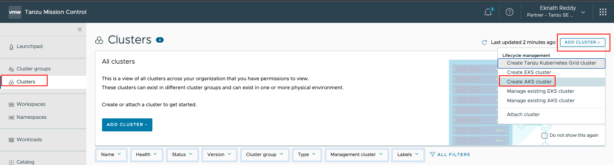
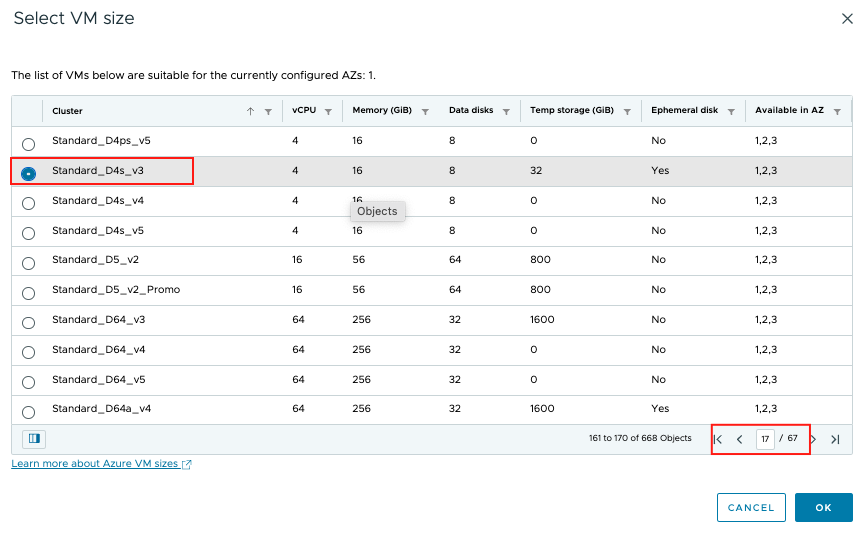
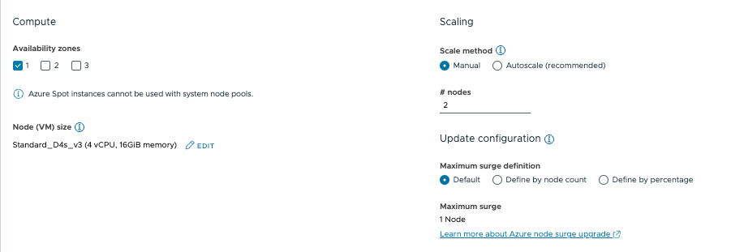

<p style="color:blue"><strong> Click here to test the execution in terminal</strong></p>

```execute-1
echo "Hello, Welcome to Partner workshop session"
```

<p style="color:blue"><strong> Click here to check the Tanzu version</strong></p>

```execute
tanzu version
```

<p style="color:blue"><strong> Click here to check the AZ version</strong></p>

```execute
az --version
```

<p style="color:blue"><strong> Click here to check the kubectl version</strong></p>

```execute
kubectl version
```

<p style="color:blue"><strong> Set environment variable </strong></p>

```execute-all
export SESSION_NAME={{ session_namespace }}
```

###### Check below repo to view the workload content: 

```dashboard:open-url
url: https://gitea-tapdemo.tap.tanzupartnerdemo.com/tapdemo-user/tanzu-java-web-app
```

###### Create an AKS Cluster from TMC Console

* Navigate to TMC Console > Clusters > Add Cluster > Create AKS Cluster

```dashboard:open-url
url: https://partnertanzuseamericas.tmc.cloud.vmware.com/
```
  

###### Provide below details:

* Cluster name: **{{ session_namespace }}-tap**
* Cluster group: **{{ session_namespace }}-cg** and click **Next**
* Account credential: **Leave to default**, if not thing shown then select: 
* Subscription: **Leave to default**
* Resource group: **explorebooth-rg** , Leave other options as default and click **Next**
* Select the Nodepool Compute as below:

  * Availability Zones: **1**
  * Edit the Node size and select **Standard_DS4_V3**
  * Scale Method: **Manual** and nodes to **3**
  * Click **Next** and **Create**
   
    

    

Note: Wait for the cluster creation to complete, should take around 5-10 mins. 

###### Connect to AKS Cluster 

**Authenticate to TMC CLI**

If you don't have an API token to access TMC, see [How Do I Generate API Tokens](https://docs.vmware.com/en/VMware-Cloud-services/services/Using-VMware-Cloud-Services/GUID-E2A3B1C1-E9AD-4B00-A6B6-88D31FCDDF7C.html) documentation.   

* Provide your API Token and press enter
* For the login context name, leave it to default

```execute-1
tmc login -n {{ session_namespace }} --no-configure
```

* Configure environment defaults that make the CLI easier to use. 

```execute-1
tmc system context configure -l "log" -m attached -p attached
```

```execute-1
tmc cluster auth kubeconfig get {{ session_namespace }} > kubeconfig.yaml 
```

```execute-1
kubectl get po -A --kubeconfig=kubeconfig.yaml
```

```execute-1
cp kubeconfig.yaml ~/.kube/config 
```

* Check the current context

```execute-1
kubectl config get-contexts
```

```execute-1
kubectl get nodes
```


###### Provide ACR repo password and execute

```execute
export DOCKER_REGISTRY_PASSWORD=D8p25yfQXLwA1yfh0vl319OOLjRUk4Hfa44NiCepCZ+ACRBgLRZ5
```
  
<p style="color:blue"><strong> Docker login to image repo </strong></p>

```execute
docker login tapworkshopoperators.azurecr.io -u tapworkshopoperators -p $DOCKER_REGISTRY_PASSWORD
```

<p style="color:blue"><strong> Check if the current context is set to "{{ session_namespace }}-cluster" </strong></p>

```execute
kubectl config get-contexts
```


<p style="color:blue"><strong> Create a namespace </strong></p>

```execute
kubectl create ns tap-install
```

```execute
kubectl create ns tap-workload
```

<p style="color:blue"><strong> Set environment variable </strong></p>


```execute
export INSTALL_BUNDLE=registry.tanzu.vmware.com/tanzu-cluster-essentials/cluster-essentials-bundle@sha256:79abddbc3b49b44fc368fede0dab93c266ff7c1fe305e2d555ed52d00361b446
export INSTALL_REGISTRY_HOSTNAME=registry.tanzu.vmware.com
```

<p style="color:blue"><strong> Env variable </strong></p>

```execute
export INSTALL_REGISTRY_USERNAME=eknath.reddy09@gmail.com
```

<p style="color:blue"><strong> Env variable </strong></p>

```execute
export INSTALL_REGISTRY_PASSWORD=Newstart@1
```

```execute
cd $HOME/tanzu-cluster-essentials
```

<p style="color:blue"><strong> Install cluster essentials in {{ session_namespace }}-cluster  </strong></p>

```execute
./install.sh -y
```


<p style="color:blue"><strong> Create tap-registry secret </strong></p>

```execute
sudo tanzu secret registry add tap-registry --username tapworkshopoperators --password $DOCKER_REGISTRY_PASSWORD --server tapworkshopoperators.azurecr.io --export-to-all-namespaces --yes --namespace tap-install
```


```execute
sudo tanzu secret registry add registry-credentials --username tapworkshopoperators --password $DOCKER_REGISTRY_PASSWORD --server tapworkshopoperators.azurecr.io --export-to-all-namespaces --yes --namespace tap-workload
```

<p style="color:blue"><strong> Verify the pods in kapp-controller namespace  and secretgen-controller </strong></p>

```execute
kubectl get pods -n kapp-controller
```

```execute
kubectl get pods -n secretgen-controller
```

<p style="color:blue"><strong> Changes to tap values file" </strong></p>

```execute
sed -i -r "s/password-registry/$DOCKER_REGISTRY_PASSWORD/g" $HOME/tap-values.yaml
```

```execute
sed -i -r "s/SESSION_NAME/$SESSION_NAME/g" $HOME/tap-values.yaml
```

```execute
sed -i -r "s/SESSION_NAME/$SESSION_NAME/g" $HOME/tas-adapter-values.yaml
```
