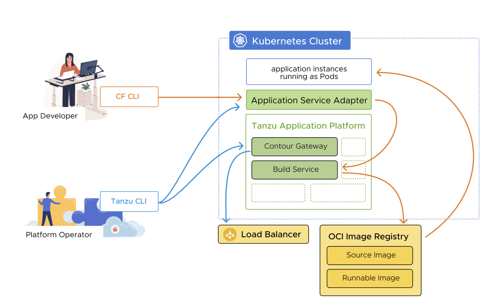

Application Service Adapter provides compatibility with CF client interfaces while running on top of K8s and integrating with Tanzu Application Platform. 

With Application Service Adapter, development teams using Tanzu Application Service for VMs tooling, such as the Cloud Foundry command-line interface (cf CLI) and other clients of the Cloud Foundry API (CAPI), can maintain their familiar workflows while their platform teams transition their infrastructure and deployments to Kubernetes.



```dashboard:open-url
url: https://docs.vmware.com/en/Application-Service-Adapter-for-VMware-Tanzu-Application-Platform/1.2/tas-adapter/install-prerequisites.html
```

<p style="color:blue"><strong> Set up environment variables for the installation </strong></p>

```execute-1
export TAS_ADAPTER_VERSION=1.2.0
```

<p style="color:blue"><strong> Verify that the tap-install namespace exists in your cluster </strong></p>

```execute-1
kubectl get ns tap-install
```

<p style="color:blue"><strong> Create a registry secret to store your VMware Tanzu Network credentials in the tap-install namespace </strong></p>

```execute-1
tanzu secret registry add tanzunet-tas-adapter-registry --username "eknath.reddy09@gmail.com  --password Newstart@1  --server registry.tanzu.vmware.com --export-to-all-namespaces --yes  --namespace tap-install"
```
<p style="color:blue"><strong> Add the Application Service Adapter package repository to the cluster </strong></p>

```execute-1
tanzu package repository add tas-adapter-repository --url registry.tanzu.vmware.com/app-service-adapter/tas-adapter-package-repo:${TAS_ADAPTER_VERSION} --namespace tap-install
```
<p style="color:blue"><strong> Verify that the package repository contains the Application Service Adapter package. </strong></p>

```execute-1
tanzu package available list --namespace tap-install
```

<p style="color:blue"><strong> create namespace for API TLS SECRET </strong></p>

```execute-1
kubectl create namespace api-tls-cfadapter
```
<p style="color:blue"><strong> create namespace for APPS TLS SECRET </strong></p>

```execute-1
kubectl create namespace apps-tls-cfadapter
```
<p style="color:blue"><strong> Create secret for API  </strong></p>

```execute-1
kubectl create secret tls --cert= --key=  --namespace api-tls-cfadapter
```

<p style="color:blue"><strong> Create secret for APPS  </strong></p>

```execute-1
kubectl create secret tls --cert= --key=  --namespace apps-tls-cfadapter
```

